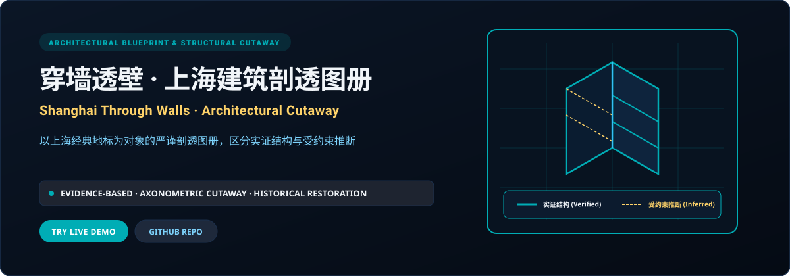
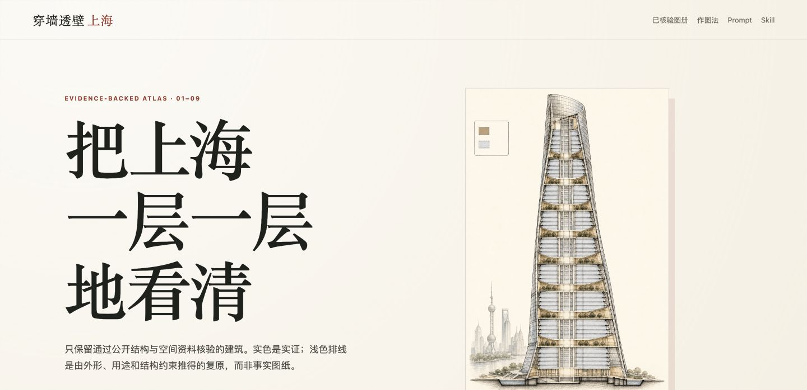

<p align="right">
  <a href="./README.md">简体中文</a> · <strong>English</strong>
</p>

<p align="center">
  
</p>

<p align="center">
  <a href="https://shanghai-through-walls.xiaosang.cc/"><strong>🌐 Live Demo (Primary)</strong></a> · 
  <a href="https://holynova.github.io/shanghai-through-walls/"><strong>🚀 Mirror (GitHub Pages)</strong></a> · 
  <a href="https://github.com/holynova/shanghai-through-walls"><strong>📦 GitHub Source</strong></a> · 
  <a href="https://xiaosang.cc/"><strong>✨ Portfolio</strong></a>
</p>

---

## Proof of Work

<p align="center">
  
</p>

---

## What It Is

An evidence-grounded architectural cutaway atlas documenting famous Shanghai landmarks. Built on rigorous axonometric drawings, the drawings explicitly separate verified, public-record structures (solid ink lines) from literature-constrained speculative reconstructions (light dashed hatching), balancing scholarship with spatial visual storytelling.

---

## Why It Matters (Key Features)

- **Dual-Track Drafting Standard**: Solid lines indicate historically verified structural records; dashed hatching marks literature-backed constrained reconstructions.
- **Axonometric Cutaway Perspective**: Peels back facades to reveal vertical elevator cores, load-bearing frames, and circulation routes.
- **Historical Archival Cross-Referencing**: Cites original blueprints, municipal records, and survey maps.
- **High-Resolution Deep Zoom**: Interactive pan-and-zoom inspection of structural joints, brick masonry, and rooflines.

---

## Inventory & Scope

Wukang Mansion, Park Hotel, Broadway Mansions, Xujiahui Cathedral, Ohel Moishe Synagogue, Shanghai Symphony Hall, Shanghai Tower.

---

## Quick Start

### 1. Live Demos
Experience it directly in your browser without any setup:
- 🌐 **Primary Demo**: [https://shanghai-through-walls.xiaosang.cc/](https://shanghai-through-walls.xiaosang.cc/)
- 🚀 **Alternative Mirror (GitHub Pages)**: [https://holynova.github.io/shanghai-through-walls/](https://holynova.github.io/shanghai-through-walls/)

### 2. Local Development
Clone the repository and launch locally:

```bash
git clone https://github.com/holynova/shanghai-through-walls.git
cd shanghai-through-walls
npm install && npm run dev
```

---

## License & Author

- **Author**: [holynova (Xiaosang)](https://xiaosang.cc/)
- **License**: [MIT License](./LICENSE)
- **Featured Collection**: Curated as part of [Where Craft Lives (xiaosang.cc)](https://xiaosang.cc/).
